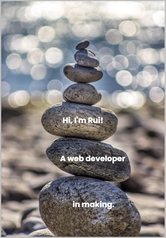

<!-- add banner-->

    

    Full-stack developer with a passion for problem-solving and a knack for analytical thinking 🤔. With a strong focus on delivering solutions, and with skills through years of experience working collaboratively in dynamic teams ⚙️. Beyond technical expertise, played leadership roles, consistently demonstrating dedication to project success and commitment to fostering a results-driven work environment 🥇.

<a href="https://www.linkedin.com/in/ruisilva775/" target="blank">You can found me here!&nbsp&nbsp🔍</a>
 
<h2 align="center">Technology Stack </h2>

 
    &nbsp&nbsp
    &nbsp&nbsp 
    &nbsp&nbsp 
    &nbsp&nbsp
    &nbsp&nbsp 
    &nbsp&nbsp 
    &nbsp&nbsp 
    &nbsp&nbsp
    &nbsp&nbsp
    &nbsp&nbsp
    &nbsp&nbsp
    &nbsp&nbsp
    

<h2 align="center">My GitHub Status</h2>

  

